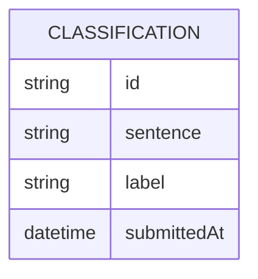

# very-agent-who — Domain Model

The system keeps one record per sentence a calling system submits, pairing the
sentence with the label the agent produced for it.

- **Classification**: one row per submitted sentence — the text as received,
the resulting label (`"threatening"` or `"not threatening"`), and when it
was submitted. Rows are kept indefinitely and are never edited or deleted.

